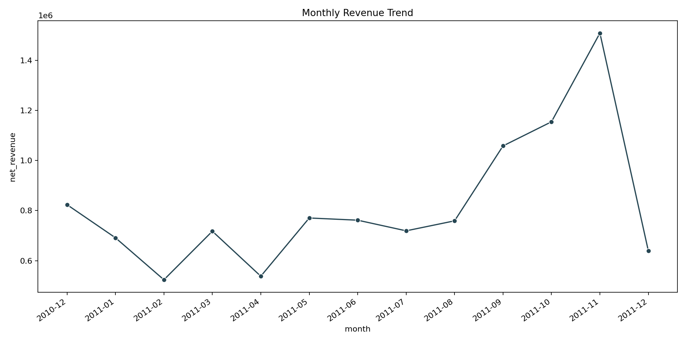
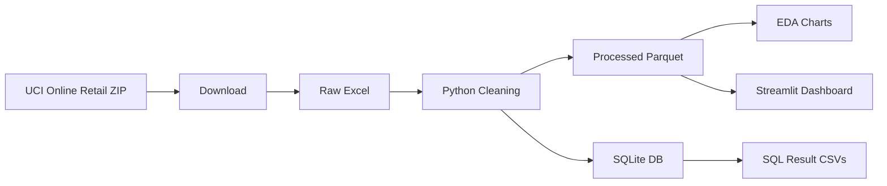
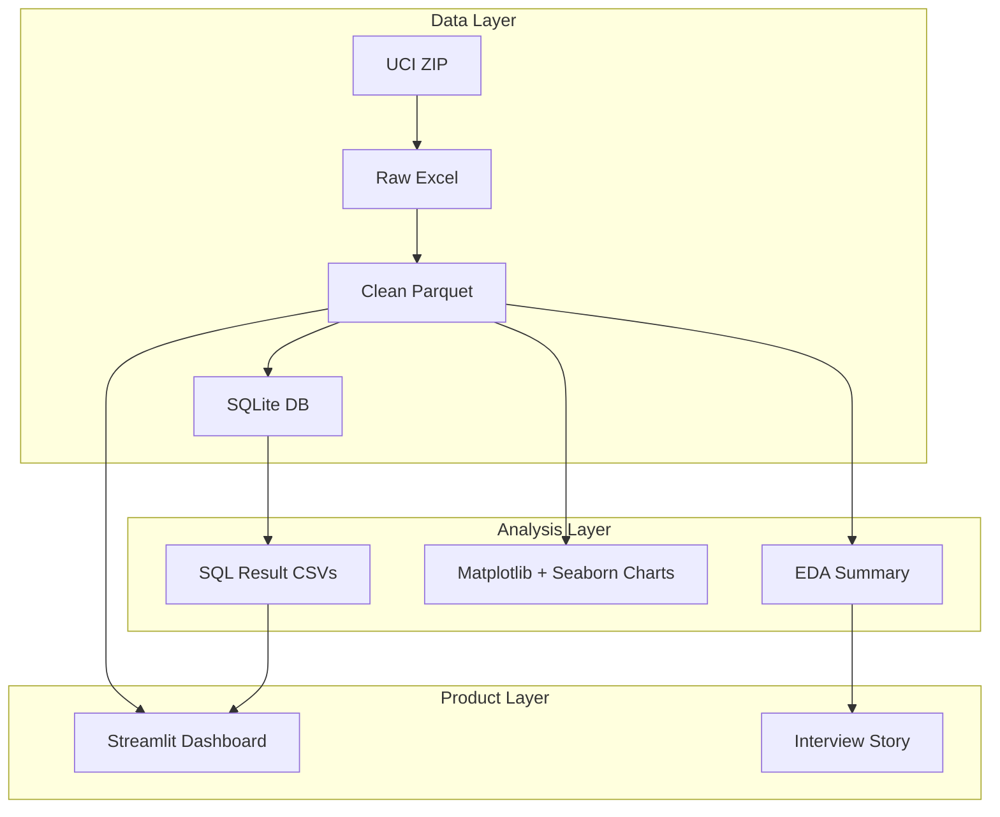

<h1 align="center">Retail Revenue Intelligence</h1>

<p align="center">
  <b>End-to-end open-source retail analytics with Python EDA, SQL, and an interactive Streamlit dashboard.</b>
</p>

<p align="center">
  
  
  
  
  
</p>

An end-to-end data analytics project using the UCI Online Retail dataset. The project covers data download, cleaning, EDA, SQL analysis, and a Streamlit dashboard.

## Portfolio Snapshot

| Area | What this project proves |
|---|---|
| Business analytics | Revenue, product, country, customer, and cancellation analysis. |
| Python | Downloading, cleaning, feature engineering, EDA, visualization. |
| SQL | Repeatable business queries using SQLite. |
| Dashboarding | Interactive Streamlit + Plotly dashboard. |
| Communication | Workflow docs, data dictionary, interview guide, and dashboard walkthrough. |

## Preview



## Business Goal

Help a retail leadership team answer:

- Which countries drive the most revenue?
- Which products perform best?
- Which customers deserve retention focus?
- When does demand peak?
- Where do cancellations or returns create risk?

## Dataset

Source: UCI Machine Learning Repository, Online Retail dataset.

The data contains transactional records for a UK-based online retail store between 2010 and 2011.

## Architecture





## Run End to End

```bash
git clone https://github.com/analyticsdurgesh/Retail-Revenue-Intelligence.git
cd Retail-Revenue-Intelligence
python -m venv .venv
source .venv/bin/activate
pip install -r requirements.txt
bash scripts/run_all.sh
streamlit run dashboard/app.py
```

Open:

```text
http://localhost:8501
```

## Project Steps

1. `src/download_data.py` downloads the UCI ZIP file and extracts the Excel workbook.
2. `src/prepare_data.py` cleans columns, creates revenue fields, adds time features, writes Parquet, and builds SQLite.
3. `src/eda.py` uses pandas, seaborn, and matplotlib to generate exploratory charts and an EDA summary.
4. `src/sql_analysis.py` runs business SQL queries and exports result CSVs.
5. `dashboard/app.py` creates an interactive Streamlit + Plotly dashboard.

## Documentation

- [End-to-End Usage Guide](docs/end_to_end_usage.md)
- [Workflow](docs/workflow.md)
- [Data Dictionary](docs/data_dictionary.md)
- [Dashboard Walkthrough](docs/dashboard_walkthrough.md)
- [Interview Guide](docs/interview_guide.md)
- [SQL Queries](sql/analysis_queries.sql)

## SQL Questions Answered

- Monthly revenue and order trend.
- Top countries by revenue and customers.
- Top products by revenue and units sold.
- Customer RFM-style ranking.
- Cancellation rate by country.

## Dashboard Views

- Revenue overview.
- Top countries and products.
- Revenue by day and hour.
- Customer RFM scatter plot.
- SQL insights tables.

## Generated Analytical Assets

| Asset | Path |
|---|---|
| EDA summary | `outputs/eda_summary.md` |
| Revenue trend chart | `outputs/figures/monthly_revenue_trend.png` |
| Country revenue chart | `outputs/figures/top_countries_revenue.png` |
| Product revenue chart | `outputs/figures/top_products_revenue.png` |
| SQL results | `outputs/sql_results/*.csv` |

## Interview Story

> I built this as a retail leadership analytics product. The pipeline starts from public raw transaction data, cleans and models it with Python, stores analysis-ready data in Parquet and SQLite, answers business questions with SQL, and serves the insights through an interactive dashboard. It demonstrates the full analytics loop: data sourcing, cleaning, EDA, SQL, visualization, and stakeholder communication.

## Folder Map

```text
data/raw/               raw downloaded data, ignored by git
data/processed/         parquet and sqlite analytics DB, ignored by git
outputs/figures/        generated EDA images
outputs/sql_results/    exported SQL result CSVs
src/                    pipeline scripts
dashboard/              Streamlit dashboard
```
